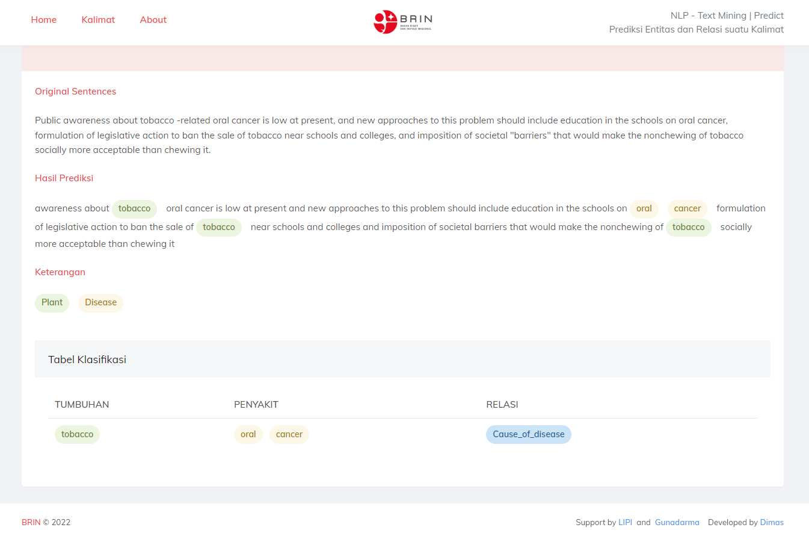

# Django Websites Named Entity Recognition and Relation Extraction

## Websites Test
| Prediksi                       | Prediksi Time (Hour:Minutes:Seconds) | Framework | Runtime                  | Ram  | Disk               | Machine          |
| ------------------------------ | --------------------------------------- | --------- | ------------------------ | ---- | ------------------ | ---------------- |
| Named Entity Recognition (NER) | 00.00.06                                | Django    | GPU Tesla P100-PCIE-16GB | High | Google Drive 100gb | Google Colab Pro |
| Relation Extraction (RE)       | 00.03.01                                | Django    | GPU Tesla P100-PCIE-16GB | High | Google Drive 100gb | Google Colab Pro |

## After

## Demo

## NER Research (BILSTM-CRF)
| Model           | Micro F1 | Macro F1 | Weighted F1 | Training Time (Hour:Minutes:Seconds) | Runtime                  | Ram  | Disk               | Machine          |
| --------------- | -------- | -------- | ----------- | --------------------------------------- | ------------------------ | ---- | ------------------ | ---------------- |
| CRF             | 77%      | 77%      | 77%         | 0.00.13                                 | GPU Tesla P100-PCIE-16GB | High | Google Drive 100gb | Google Colab Pro |
| BILSTM          | 75%      | 76%      | 75%         | 0.06.21                                 | GPU Tesla P100-PCIE-16GB | High | Google Drive 100gb | Google Colab Pro |
| BERT            | 61%      | 60%      | 61%         | 0.22.35                                 | GPU Tesla P100-PCIE-16GB | High | Google Drive 100gb | Google Colab Pro |
| BILSTM-CRF      | 87%      | 86%      | 86%         | 0.59.04                                 | GPU Tesla P100-PCIE-16GB | High | Google Drive 100gb | Google Colab Pro |
| BERT-CRF        | 58%      | 57%      | 58%         | 1.01.40                                 | GPU Tesla P100-PCIE-16GB | High | Google Drive 100gb | Google Colab Pro |
| BERT-BILSTM     | 61%      | 60%      | 61%         | 0.25.28                                 | GPU Tesla P100-PCIE-16GB | High | Google Drive 100gb | Google Colab Pro |
| BERT-BILSTM-CRF | 60%      | 59%      | 60%         | 1.04.07                                 | GPU Tesla P100-PCIE-16GB | High | Google Drive 100gb | Google Colab Pro |

## RE Research (BILSTM-CRF)
| Model      | Micro F1 | Macro F1 | Weighted F1 | Training Time (Hour:Minutes:Seconds) | Runtime                  | Ram  | Disk               | Machine          |
| ---------- | -------- | -------- | ----------- | --------------------------------------- | ------------------------ | ---- | ------------------ | ---------------- |
| BERT       | 79%      | 84%      | 79%         | 00.41.07                                | GPU Tesla P100-PCIE-16GB | High | Google Drive 100gb | Google Colab Pro |
| BILSTM-CRF | 75%      | 64%      | 64%         | 1.07.48                                 | GPU Tesla P100-PCIE-16GB | High | Google Drive 100gb | Google Colab Pro |
