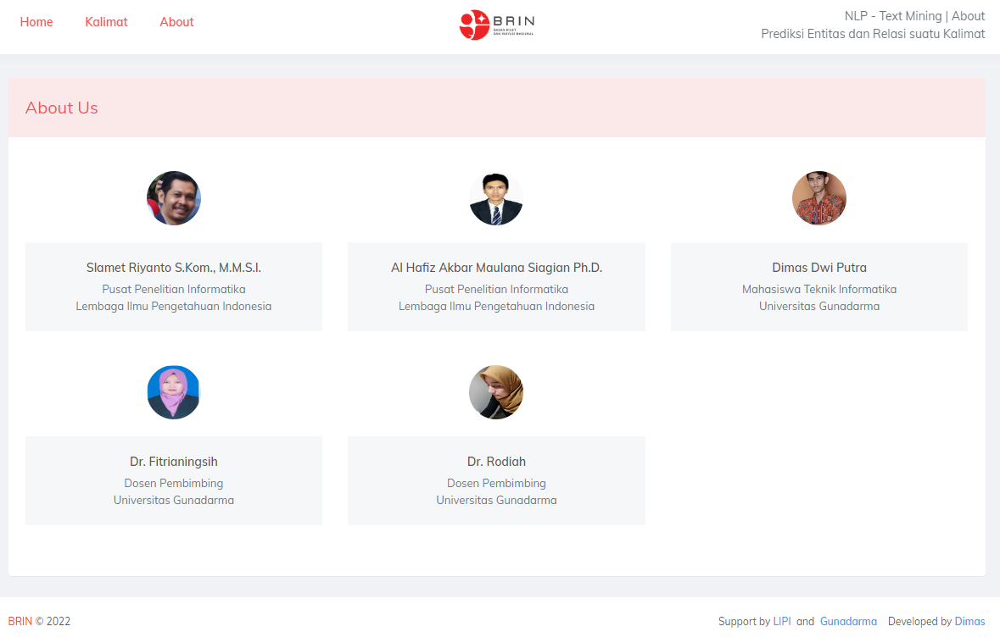

# Django Websites Named Entity Recognition and Relation Extraction

<!--
### Team
    
-->

### Support
  

## Demo

## Result

## About

## NER Research (BILSTM-CRF)
| Model           | Micro F1 | Macro F1 | Weighted F1 | Training Time (Hour:Minutes:Seconds) | Runtime                  | Ram  | Disk               | Machine          |
| --------------- | -------- | -------- | ----------- | --------------------------------------- | ------------------------ | ---- | ------------------ | ---------------- |
| CRF             | 77%      | 77%      | 77%         | 0:00:13                                 | GPU Tesla P100-PCIE-16GB | High | Google Drive 100gb | Google Colab Pro |
| BILSTM          | 75%      | 76%      | 75%         | 0:06:21                                 | GPU Tesla P100-PCIE-16GB | High | Google Drive 100gb | Google Colab Pro |
| BERT            | 61%      | 60%      | 61%         | 0:22:35                                 | GPU Tesla P100-PCIE-16GB | High | Google Drive 100gb | Google Colab Pro |
| BILSTM-CRF      | 87%      | 86%      | 86%         | 0:59:04                                 | GPU Tesla P100-PCIE-16GB | High | Google Drive 100gb | Google Colab Pro |
| BERT-CRF        | 58%      | 57%      | 58%         | 1:01:40                                 | GPU Tesla P100-PCIE-16GB | High | Google Drive 100gb | Google Colab Pro |
| BERT-BILSTM     | 61%      | 60%      | 61%         | 0:25:28                                 | GPU Tesla P100-PCIE-16GB | High | Google Drive 100gb | Google Colab Pro |
| BERT-BILSTM-CRF | 60%      | 59%      | 60%         | 1:04:07                                 | GPU Tesla P100-PCIE-16GB | High | Google Drive 100gb | Google Colab Pro |

## RE Research (BILSTM-CRF)
| Model      | Micro F1 | Macro F1 | Weighted F1 | Training Time (Hour:Minutes:Seconds) | Runtime                  | Ram  | Disk               | Machine          |
| ---------- | -------- | -------- | ----------- | --------------------------------------- | ------------------------ | ---- | ------------------ | ---------------- |
| BERT       | 79%      | 84%      | 79%         | 0:41:07                                 | GPU Tesla P100-PCIE-16GB | High | Google Drive 100gb | Google Colab Pro |
| BILSTM-CRF | 78%      | 63%      | 78%         | 0:52:33                                 | GPU Tesla P100-PCIE-16GB | High | Google Drive 100gb | Google Colab Pro |

## Websites Test
| Prediksi                       | Prediksi Time (Hour:Minutes:Seconds) | Framework | Runtime                  | Ram  | Disk               | Machine          |
| ------------------------------ | --------------------------------------- | --------- | ------------------------ | ---- | ------------------ | ---------------- |
| Named Entity Recognition (NER) | 00.00.06                                | Django    | GPU Tesla P100-PCIE-16GB | High | Google Drive 100gb | Google Colab Pro |
| Relation Extraction (RE)       | 00.03.01                                | Django    | GPU Tesla P100-PCIE-16GB | High | Google Drive 100gb | Google Colab Pro |

# **Other Content**

### **Websites Prediction**
#### [1. Django Websites Prediction For NER dan RE](https://github.com/Dimas263/Django-Websites_NER_RE)

### **Named Entity Recognition (NER)**
#### [1. NER Dataset Biomedical Plant-Disease Corpus](https://github.com/Dimas263/NLP_NER_Dataset_Biomedical_Plant-Disease_Corpus)
#### [2. NER CRF Named Entity Recognition](https://github.com/Dimas263/NLP_NER_CRF_Named_Entity_Recognition)
#### [3. NER BiLSTM Named Entity Recognition](https://github.com/Dimas263/NLP_NER_BILSTM_Named_Entity_Recognition)
#### [4. NER BERT Named Entity Recognition](https://github.com/Dimas263/NLP_NER_BERT_Named_Entity_Recognition)
#### [5. NER BiLSTM CRF Named Entity Recognition](https://github.com/Dimas263/NLP_NER_BILSTM_CRF_Named_Entity_Recognition)
#### [6. NER BERT BiLSTM CRF Named Entity Recognition](https://github.com/Dimas263/NLP_NER_BERT_BILSTM_CRF_Named_Entity_Recognition)

### **Relation Extraction (NER)**
#### [1. RE Dataset Biomedical Plant-Disease Corpus](https://github.com/Dimas263/NLP_RE_Dataset_Biomedical_Plant-Disease_Corpus)
#### [2. RE BERT Relation Extraction Biomedical](https://github.com/Dimas263/NLP_RE_BERT_Relation_Extraction_Biomedical)
#### [3. RE BiLSTM CRF Relation Extraction Biomedical](https://github.com/Dimas263/NLP_RE_BILSTM_CRF_Relation_Extraction_Biomedical)
